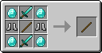
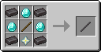
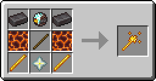
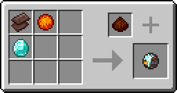

# OP Items

## Contents
Adds 3 OP sticks: the Knockback Stick, the Better Knockback Stick, and the Fire Stick, which are all very overpowered.  
Also adds 3 other items: Blaze Core Residue, Raw Blaze Core, and Refined Blaze Core.

| Knockback Stick | Better Knockback Stick | Fire Stick | Raw Blaze Core | Refined Blaze Core | Blaze Core Residue |
| - | - | - | - | - | - |
|  |  |  |  |  | 

## Recipes
| Knockback Stick | Better Knockback Stick | Fire Stick |
| - | - | - |
|  |  |  |

(The sticks in the Better Knockback Stick and Fire Stick recipe's are actually Knockback Sticks, not sticks.)

### Other Recipes
| Refined Blaze Core | Blaze God Summoning |
| - | - |
|  | Drop:  `5 Netherite Ingots, 4 Diamond Blocks, 16 Blaze Rods, 1 Nether Star`  on the ground to summon the Blaze God. It has a 99% chance to drop the [Raw Blaze Core](#contents).|

## Changelog
Click [here](CHANGELOG.md) for the changelog!

## Dependencies
The dependencies are:
| Dependency | Version |
| - | - |
| Fabric API | Any Version|

## Build
If you want pre-releases (usually won't be very polished on the new bits), check out the Actions tab!  
The latest (successful) action's artifact is a .zip file containing the .jar file for the latest pre-release.  
 

### Building
`git clone` the repo, navigate to it, and run one of the following in the terminal/command prompt:
- On Windows:
  - `gradlew.bat build`
  - Or run `BUILD_MOD.bat`
- On Linux/MacOS X:
  - `./gradlew build` (If it doesn't let you, run `chmod +x gradlew` first!)
  - Or run `BUILD_MOD.sh` with `bash`
  
The .jar file will be in the build/libs directory.
