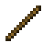
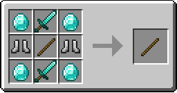
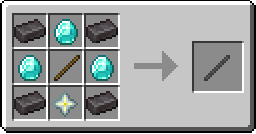

# OP Items

## Contents
Adds 2 new items: the Knockback Stick, and the Better Knockback Stick, which are both very overpowered.

| Knockback Stick | Better Knockback Stick |
| - | - |
|  |  |

## Recipes
| Knockback Stick | Better Knockback Stick |
| - | - |
|  |  |

(The stick in the Better Knockback Stick Recipe is actually a Knockback Stick, not a stick.)

## Changelog
Click [here](CHANGELOG.md) for the changelog!

## Dependencies
The dependencies are:
| Dependency | Version |
| - | - |
| Fabric API | Any Version|

## Build
If you want pre-releases (usually won't be very polished on the new bits), check out the Actions tab!  
The latest action's artifact is a .zip file containing the .jar file for the latest pre-release.  
 
`git clone` the repo, navigate to it, and run one of the following in the terminal/command prompt:
- On Windows:
  - `gradlew.bat build`
  - Or run `BUILD_MOD.bat`
- On Linux/MacOS X:
  - `./gradlew build`
  - Or run `BUILD_MOD.sh` with `bash`
  
The .jar file will be in the build/libs directory.
